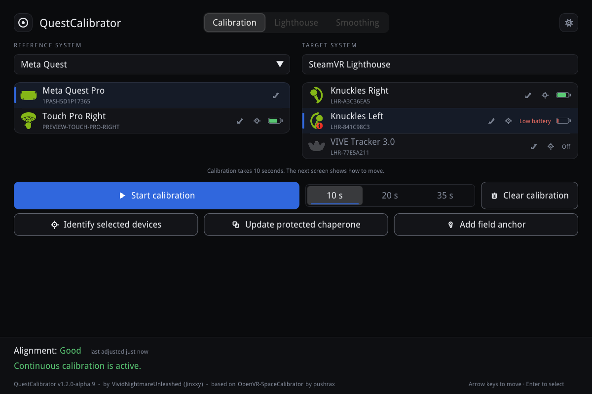
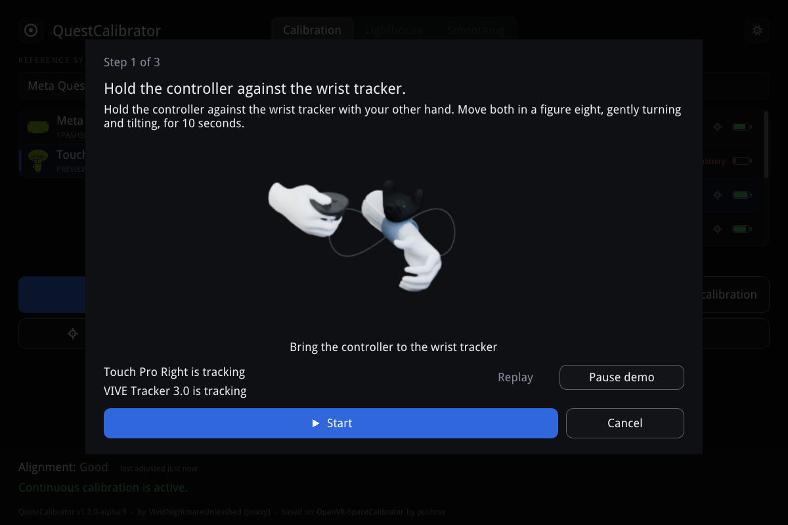
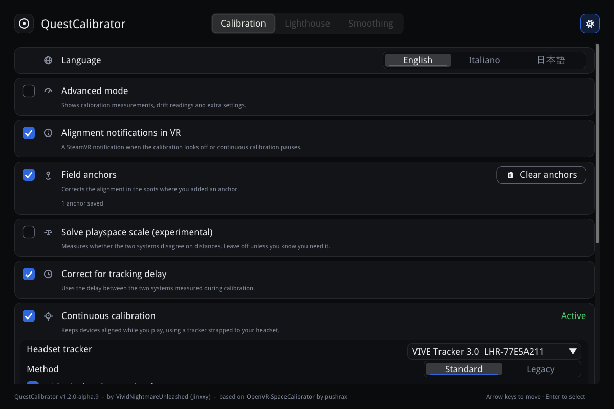
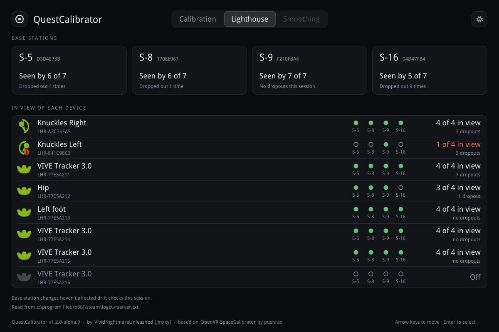

# QuestCalibrator

Play in SteamVR with a Meta Quest headset and lighthouse trackers or controllers at
the same time. QuestCalibrator lines the two tracking systems up into one playspace,
so your full-body trackers sit where your body is, and it can keep them lined up
while you play.

It started as a fork of
[OpenVR-SpaceCalibrator](https://github.com/pushrax/OpenVR-SpaceCalibrator) and has
since been largely rewritten, so calibrating is more accurate and harder to get wrong.



> **Before you install:** uninstall or disable OpenVR-SpaceCalibrator, and any fork
> of it. Both install a SteamVR driver that moves your devices, and two running at
> once will throw your tracking off.

## Install

1. Download `QuestCalibrator-<version>.zip` from the
   [latest release](https://github.com/VividNightmareUnleashed/QuestCalibrator/releases/latest).
   Ignore GitHub's **Source code** archives; they don't contain the program.
2. Close Steam completely, including from the system tray, not just SteamVR.
3. Extract the zip, right-click `Install.ps1` and choose **Run with PowerShell**.
   `README-INSTALL.txt` in the zip covers unblocking the files and a manual
   install.

QuestCalibrator then opens in the SteamVR dashboard every time SteamVR starts.
The installer asks whether you want the optional **Lighthouse** module, a tab that
shows your base stations and which of them each device can see. Run the installer
again to add or remove it.

Every release lists the SHA-256 of its zip and a VirusTotal report for each file in
it. Only download QuestCalibrator from this repository's releases.

## Calibrate

Pick a Quest device on the left and a lighthouse device on the right, then press
**Start calibration**. You'll hold the two together and move them for 10 seconds
(20 or 35 if you choose); the next screen shows you how.



When it finishes, check in VR that your trackers line up. The line at the bottom of
the screen tells you how well the alignment is holding up, and QuestCalibrator can
send a SteamVR notification when it starts to look off.

If the alignment is right in one part of your room but off in another, stand in the
bad spot and press **Add field anchor**. That spot gets its own correction, blended in
as you walk around.

## Keep it aligned while you play

Quest tracking shifts during a session: the headset re-centres, loses and finds its
map, or corrects its own drift. QuestCalibrator watches for these jumps and follows
them.

For the best result, strap a spare lighthouse tracker firmly to your headset, turn on
**Continuous calibration** in Settings and pick that tracker. QuestCalibrator then
keeps the two systems lined up the whole time you play, with no recalibrating. You
can hide that tracker from games so full-body setups don't mistake it for a body
tracker.

> **Continuous calibration is experimental.** I can't test it myself and rely on
> feedback from people who use it. If you do, the best way to help is to
> [open an issue](https://github.com/VividNightmareUnleashed/QuestCalibrator/issues)
> saying how it went, with the log files described below.



Continuous calibration has two methods:

- **Standard** pauses when the readings move away from the calibration, and resumes
  once they come back or hold steady. A tracker that briefly loses its base stations
  won't drag your body trackers with it.
- **Legacy** never pauses. Like OpenVR-SpaceCalibrator, it follows every change the
  headset tracker reports.

Without a headset tracker, QuestCalibrator still corrects the jumps it can detect and
warns you when the alignment drifts.

## Base stations

With the Lighthouse module installed, the **Lighthouse** tab lists your base stations,
which ones each device can see, and which drops out most often. It's the quickest way
to find a badly placed station.



## Other things it does

- **Protected chaperone:** saves your SteamVR walls and puts them back if SteamVR or
  the headset loses them.
- **Languages:** English, Italian and Japanese, picked in Settings. The default is
  Windows' display language. The translations may not be perfect, so corrections are
  welcome as issues.
- **Updates:** off by default. Turn them on in Settings and QuestCalibrator checks
  this repository for a newer stable release. It only offers a download that matches
  the SHA-256 GitHub publishes for it, and installs only when you say so.
- **Advanced mode:** shows calibration measurements, drift readings and extra
  settings.

## Something wrong?

[Open an issue](https://github.com/VividNightmareUnleashed/QuestCalibrator/issues) and
attach both log files from `%LOCALAPPDATA%\QuestCalibrator\`: `QuestCalibrator.log`
and `QuestCalibrator.prev.log`. They record every calibration and correction, with the
numbers behind it.

If the alignment goes wrong during play, turn on **Detailed calibration logging** in
Settings. Then press **Save diagnostics file** once while things look right, and again
after the problem shows up, before you recalibrate or restart. Say whether the problem
shows in SteamVR itself or only in the game, and which devices look out of place.
Diagnostics files leave out your name and folder paths.

## How it works

[docs/how-it-works.md](docs/how-it-works.md) has the detail: what changed from
OpenVR-SpaceCalibrator, how a calibration is worked out and checked, how alignment is
kept during play, and the math behind it.

## Building from source

You need the Visual Studio 2022 build tools (v143) and the Windows 10 SDK. Everything
else is in `lib/`, so there's nothing to restore.

```powershell
tools\validate-cpp.ps1 -Mode Build
```

This builds the solution into `x64\Release\` and runs the test harness
(`SolverTests.exe`, whose exit code is the number of failed scenarios). The
`VirtualQuest` submodule is private and not needed: without it the build leaves out
the simulated-headset tests and nothing else.

To run your build, copy `Driver\01questcalibrator` into SteamVR's `drivers` folder,
put `driver_01questcalibrator.dll` in its `bin\win64`, and start `QuestCalibrator.exe`
with `openvr_api.dll`, `manifest.vrmanifest` and `icon.png` beside it.

More for contributors:

- `tools\validate-cpp.ps1 -Mode Duplicates` scans for copied code, and
  `-Mode Analyze -All` rebuilds everything under Clang-Tidy. Settings live in
  `cpp-validation.json`.
- `tools\fuzz.ps1` runs the libFuzzer and AddressSanitizer targets for every untrusted
  input, defined in `Tests/Fuzz/FuzzTargets.h`.
- GitHub Actions builds and tests every push to `alpha` and `stable` and every pull
  request, fuzzes weekly, and builds releases from tags
  ([docs/releasing.md](docs/releasing.md)).
- [docs/vendored-dependencies.md](docs/vendored-dependencies.md) lists everything in
  `lib/` and its license.
- `compile_flags.txt` is for clangd only; don't add machine-specific paths to it.

## License

QuestCalibrator is source-available: you can build and change it for your own use,
but redistributing it needs permission first and selling it isn't allowed. See
[LICENSE](LICENSE) for the exact terms.

The parts inherited from OpenVR-SpaceCalibrator, Copyright (c) 2020 Justin Li
(pushrax), stay under their original MIT License, included in `LICENSE`.
[THIRD-PARTY-NOTICES.txt](https://github.com/VividNightmareUnleashed/QuestCalibrator/blob/alpha/THIRD-PARTY-NOTICES.txt) has it with every other
third-party notice. Some calibration ideas (outlier rejection, axis-variance conditioning,
sampling raw driver poses) were inspired by the
[hyblocker fork](https://github.com/hyblocker/OpenVR-SpaceCalibrator) and written from
scratch; none of its code is included.

QuestCalibrator is not affiliated with Meta, Valve, HTC or VRChat.
